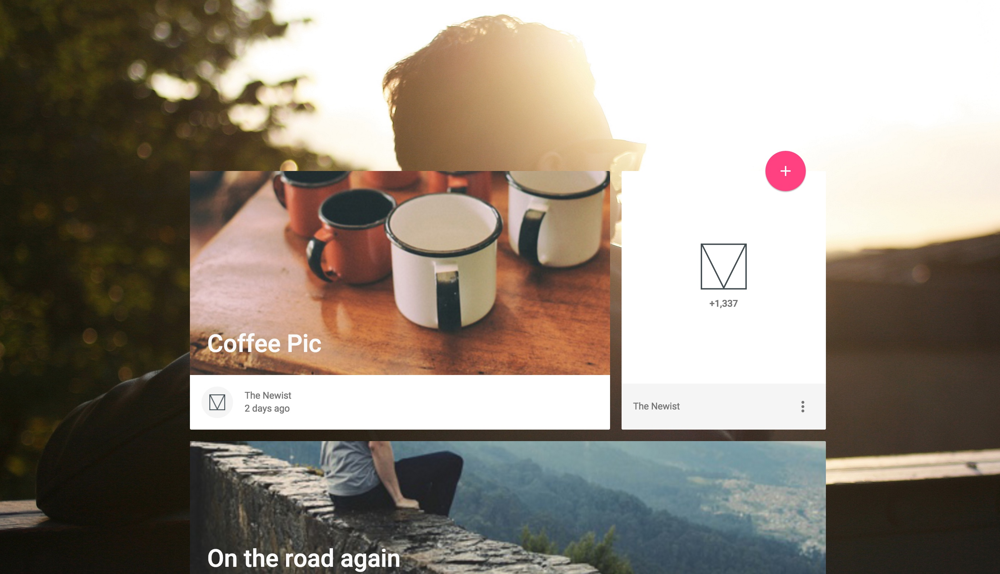

# Blog
> A mobile focused responsive template that showcases image or text based blog entries, a subscription CTA, search & share links, and an expanded article page with comments, counters and bookmarking capabilities built-in.

[http://www.getmdl.io/templates/index.html](http://www.getmdl.io/templates/index.html)




To use this template execute from your command line:
```
dnu restore
```
The `postrestore` scripts in `project.json` will install client side dependencies to the project. The MDL will be installed locally via Bower package manager and then its core main files will be moved to project web site root.

```
dnu build
```
This 'postbuild' scripts in the `project.json` will clean existing and create new minified version of client-side JavaScript and CSS files

To run project:
```
dnx kestrel
```

Thanks!
