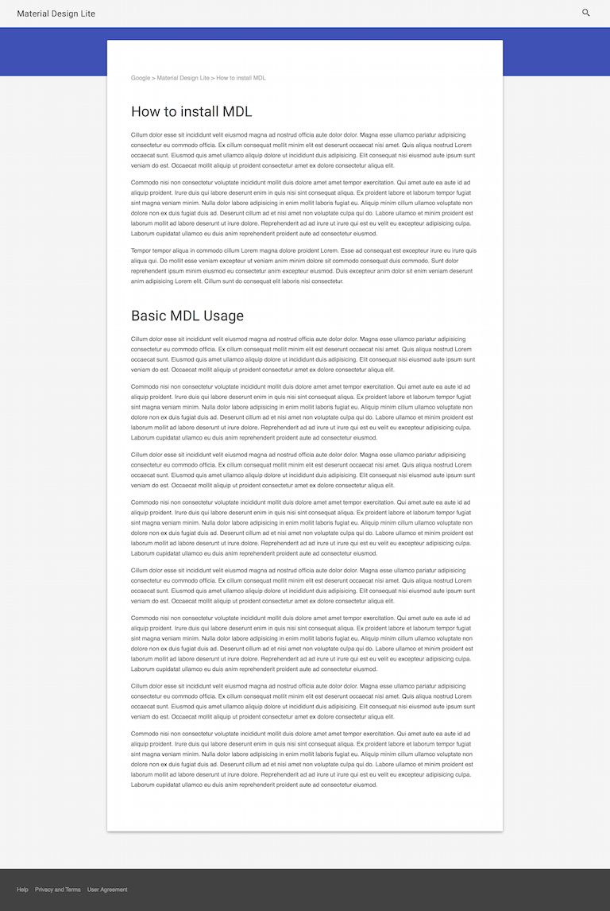

# Material Design Lite templates ported to ASP.NET 5 MVC6 projects
Material Design Lite templates as ASP5 MVC6 web projects

This project is WIP at the moment and things are in flux.

## Topics covered

* production/stagin/development dependencies management
* use of `project.json` to execute client-side installation and build-time routines
* use of `package.json` and `bower.json` for client-side dependencies managment
* use of the Bower with Gulp to manage and work with client side dependencies
* TODO: Sass (SCSS) implementation of MDL/MDI

## Templates

### Article

### Text Heavy Webpage Template

## Author

@blazejewicz
