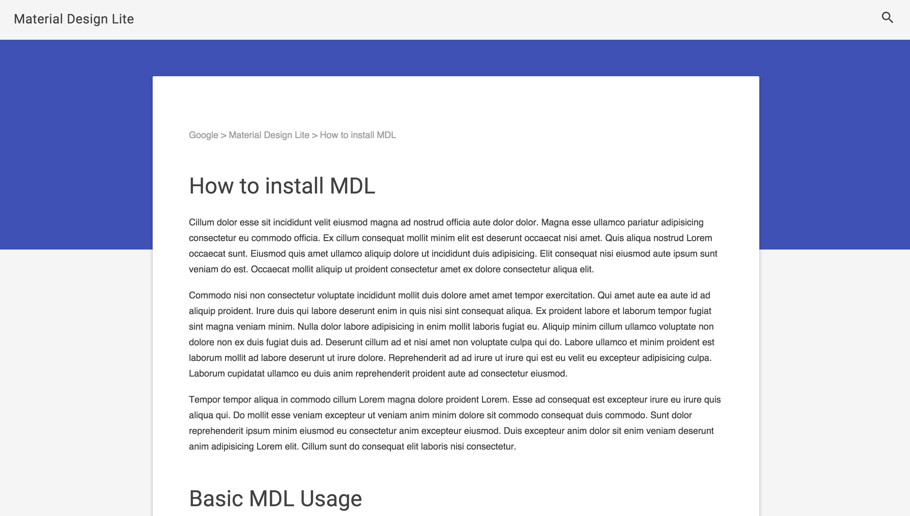
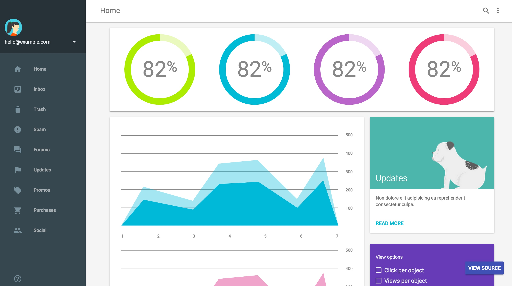

# Material Design Lite templates ported to ASP.NET 5 MVC6 projects
Material Design Lite templates as ASP5 MVC6 web projects

The original templates:
[Material Design Lite Templates](http://www.getmdl.io/templates/)

The templates are based on ASP.NET 5 `beta6` project structure and features.

This project is WIP at the moment and things are in flux.

## Topics covered

* production/stagin/development dependencies management
* use of `project.json` to execute client-side installation and build-time routines
* use of `package.json` and `bower.json` for client-side dependencies management
* use of the Bower with Gulp to manage and work with client side dependencies
* TODO: Sass (SCSS) implementation of MDL/MDI

Note: the templates use `postrestore` and `postbuild` script targets in `project.json` to integrate client side code management using NPM, Bower and Gulp.

## Templates

All templates are ported as much as possible from original static templates to ASP.NET 5 MVC6 project structure. To run given template just invoke `dnu` and `dnx` commands from template directory:
```bash
cd Article/
...
dnu restore
...
dnu build
...
dnx . kestrel
```

### Article

> A clean layout optimized for presenting text-based content with a breadcrumb nav, search, clear headers and a footer that utilizes a card-like structure to showcase the content.



## Blog
> A mobile focused responsive template that showcases image or text based blog entries, a subscription CTA, search & share links, and an expanded article page with comments, counters and bookmarking capabilities built-in.



## Dashboard

> A modular responsive template built to display data visualizations and information with a clear vertical nav, user profile, search and dedicated space for updates and filters.


### Text Heavy Webpage Template


## Author

@blazejewicz
